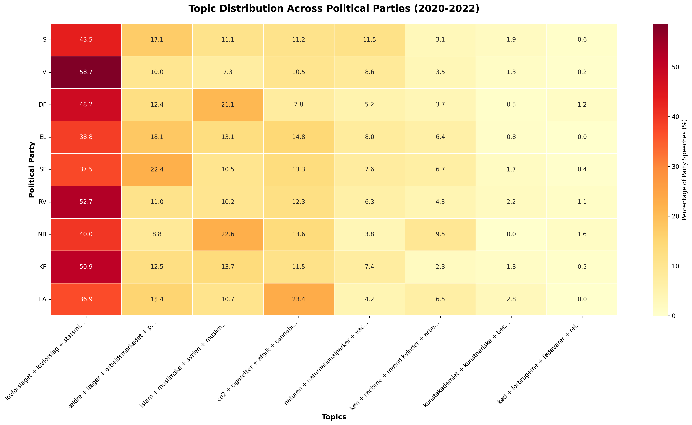
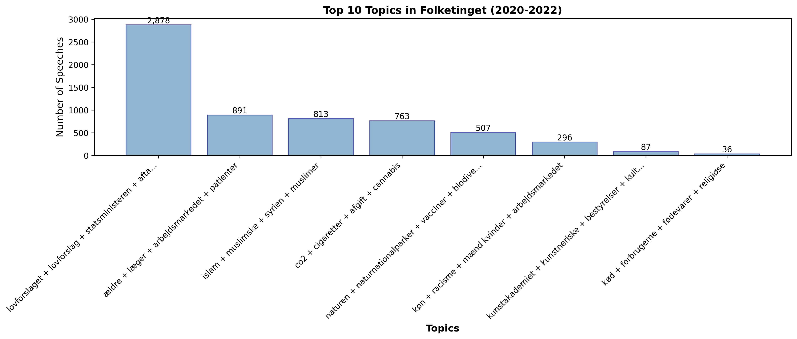
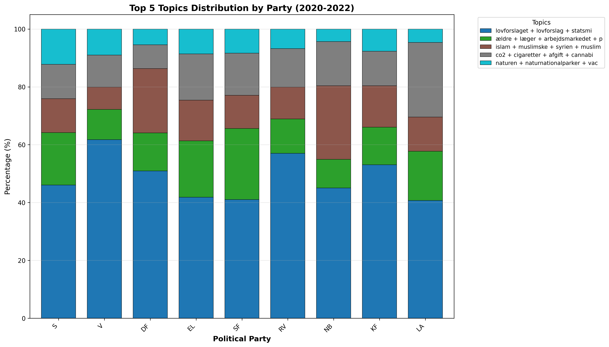

# Danish Parliament Topic Analysis (2020-2022)

Analysing what Danish politicians actually talk about in parliament (Folketinget) using topic modeling on a subset of speeches from 2020-2022.

## What is this?

This is a proof-of-concept for the NLP exam project. We wanted to see if we could automatically discover what topics Danish political parties focus on in Folketinget, and whether parties differ in what they talk about.

## Method

- **Data**: 72,000 parliamentary speeches from the Danish Folketing (2020-2022)
- **Topic Modeling**: BERTopic with multilingual embeddings
- **Stopwords**: spaCy's Danish model + common parliamentary words
- **Sample**: 15,000 speeches from 2020-2022

## What we found

The model discovered 8 main topics that Danish politicians discuss:

1. **Legislation & Agreements** (46%) - bills, political deals, procedures
2. **Healthcare & Elderly Care** (14%) - doctors, patients
3. **Islam & Immigration** (13%) - religious communities, Syria, integration  
4. **Climate & Taxes** (12%) - CO2, cigarette taxes, cannabis, green transition
5. **Nature** (8%) - biodiversity, national parks
6. **Gender Equality** (5%) - discrimination, workplace equality, social control
7. **Arts & Culture** (1%) - art academy, cultural institutions
8. **Food & Religion** (1%) - meat consumption, religious dietary rules

## Party Differences

The heat-map shows which parties emphasise which topics:



- **DF & NB** dominates discussion on Islam/immigration.
- **LA** discusses climate/taxes proportionally more than other parties

### Top Topics Overview



### Topic Distribution by Party



## Repository Structure
```
├── src/
│   ├── data_loader.py          # Load and filter folketinget data
│   ├── stopwords.py            # Danish stopwords (spaCy + specific terms)
│   ├── topic_model.py          # BERTopic training
│   ├── exploration.py          # Exploratory functions
│   └── plotting.py             # Plotting functions
├── nbs/ 
	└── main.ipynb              # Main analysis notebook
├── requirements.txt            # dependencies
├── setup.sh                    # One-time setup script
├── env_to_jupyter.sh           # Script for setting up env for jupyter
└── output/                     # Results and plots
```

## Running it yourself
First, download the data from [Parllawspeech](https://parllawspeech.org/data/). After downloading the data dataset, insert *Corpus_speeches_denmark.RDS* into [/data](data/). 
```bash
# Setup (once)
chmod +x setup.sh
./setup.sh

# Run analysis
source venv/bin/activate
bash env_to_jupyter.sh
jupyter notebook main.ipynb
```

## Next Steps

This proof-of-concept will be expanded for the exam project to include:
- Look into more parliament specific lingu to improve the accuracy of the topics. For instance, topic 1 is heavily dominated by bills, procedurals, etc., which in itself is not very interesting.
- Complete temporal analysis (2007-2022) to track topic evolution
- Sentiment analysis on controversial topics (Such as immigration, climate, etc.)
- Interactive dashboard for exploring topics and parties
- Comparison with party manifestos
